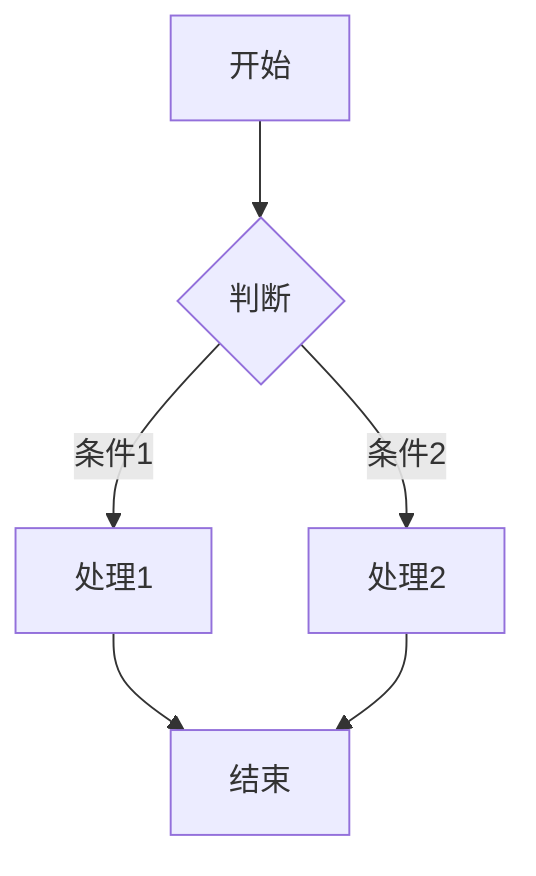
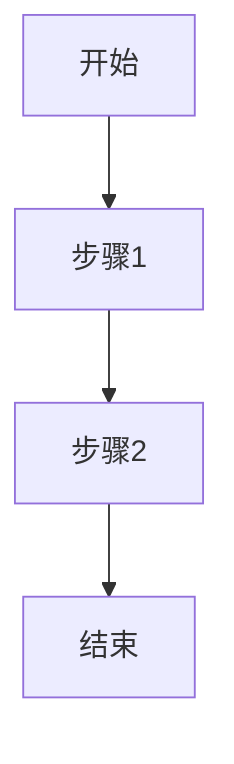

# 文档写作指南

本 skill 提供 ProjFlow 项目内 Markdown 文档的写作规范与工具速查，覆盖 Wiki 文档、会议纪要、项目 README、技术方案等。

> **与 management skill 的分工**：management skill 负责文档的**CRUD 操作**（`create_doc.py` / `update_doc.py` 等）；本 skill 负责文档**内容怎么写**（结构、Mermaid、链接、图片、公式、风格）。


## 1. 文档变更的 OpenSpec 双层流程（结构级变更必读）

> 规则源自姊妹库 pet-action-recognition 的踩坑教训：文档经多轮局部盲改后严重混乱（内容错位、编号错乱、引用悬空），根源是文档改动没走流程。ProjFlow 预先立规，防患于未然。

### 1.1 双层 Change 结构

| 层 | Change | 管什么 | 何时开 |
|---|---|---|---|
| **登记表** | `openspec/registry.md` | 所有 wiki 的**整体**：编号 / 标题 / slug / 职责边界 / 单篇 Change、新增或废弃一篇、编号体系、跨文档引用规范。**登记动作 = 直接编辑该表**（无需开 change） | 增删改一行时直接改；只有改登记表的位置/结构/规则本身才开 change |
| **单篇 Change** | `docs-<slug>`（如 `docs-api-design-conventions`） | **一篇**文档的结构与内容：章节结构、内容重构、大段增删 | 结构级变更 |

**豁免**：内容级小修（错字、更新一个数字、补一小段论证、修一处链接）**不需要 Change**——直接改，但 commit message 必须写明改了什么、为什么。判断标准：**读者需要重新理解文档结构吗？** 需要 → 走 Change；不需要 → 直接改。

### 1.2 写正文前的硬性顺序

1. 在单篇 Change 的 **design.md** 写清五件事（缺一不可）：
   - **目标读者**（自己回顾 / 团队协作 / 外部评审）
   - **完整章节结构**，到二级标题（有哪些章、每章说什么、章内细分节、整体逻辑即读者动线——为什么是这个顺序）
   - **每节要表达什么、论证什么、下什么结论**
   - **与其它文档的引用关系**（谁引用谁、职责边界在哪）
   - **需要外部调研的知识点**（列出来，不许凭空写）
2. 用户审核通过该 design
3. **之后**才能写 / 改正文；实施中按 tasks 勾进度

**禁止**：不写 design 直接改正文；凭记忆改局部（动手前必须通读目标文档全文）。

### 1.3 结构变更纪律（踩坑教训）

- **改编号 = 全仓事件**：所有跨文档引用必须级联重映射，改完跑「引用 → 标题闭合」核对（悬空引用必须为 0）
- 章节锚点**先从文件读出来再复制**，不凭记忆；python 批量编辑用三引号字符串，新文本一律「」引号
- 图优先 Mermaid，不用 ASCII 字符画
- 大改完成后：通读一遍 + 顶层树 grep + stale 引用 grep，全绿才提交
- 文档正文**不放**「术语修正」式警示语（历史归演进记录）
- **wiki 文档动笔前先登记** `openspec/registry.md`（加/改一行），再写正文；登记动作本身不需要开 change
- **不编造领域背景/文献**：需要调研的点写进 design 的调研清单，不得凭空下笔

### 1.4 正文零历史信息

**文档正文只写「现在是什么」**——历史一律只进演进记录（sidecar `changelog` / progress），正文不留任何历史痕迹。

禁止出现在正文的：

| 类型 | 例子 |
|------|------|
| 日期与版本标注 | 「机制已定，2026-09-17」「（2026-09-17 修订）」——写了就说明定了，日期归 changelog |
| 旧编号与编号对照 | 历史编号映射表、编号归档（**不追溯历史讨论**）|
| 旧版正文快照 | 归档的旧登记表、旧章节全文（json 附录也不留）|
| 迁移 / 来源标注 | 「（自 X 号并入）」「原 Y 号」|
| 废弃与变更叙述 | 「原设计 X 已作废」「曾用 X 现改 Y」「历史上用过…」「已移除的旧设计」|
| 演进动机叙述 | 「本节新增于…」「本次修订因…」|

**判断法**：这句话是在描述**系统当前的状态**，还是在描述**我们如何走到这里**？后者 → 删，或写成 changelog 的一条 summary。

**唯一例外**：指向记录位置的指引（如「已决项见 sidecar `changelog`」）与 frontmatter 的 `date` 字段。

### 1.5 章节归属：开放问题 / 已定范围 / 附属说明

切章时先判断每节的性质：

| 性质 | 放哪 | 例 |
|----|------|----|
| **开放问题**（还没定，不定就开不了工或带风险）| 「当前待决策」表 | 技术选型 / 模块拆分方式 / 是否引入某依赖 |
| **已定范围**（做什么、不做什么）| 框架总图章里的小节 | 分模块交付 / 不追求 demo 之外的完美 |
| **附属说明**（图怎么读、符号、术语对照）| **并入它服务的章**，不单独成节 | 模块地图并入框架总图；符号速查作附录 |

**判断法**：这一节是在问「**还没定什么**」，还是在陈述「**已经定成什么****」？

推论：

- **「模块地图」不单独成节**——它只是结构图的读法索引
- **「设计目标与非目标」不进待决策**——它是已定的范围界定；其中若有未定目标，一律指向**唯一登记处**，不在本文档重述
- **符号速查**作附录，不占正文章号

## 2. Wiki 文档（`management/docs/`）

### 1.1 文件规范

- **文件名**：`{slug}.md`，slug 只允许字母、数字、连字符 `-`、下划线 `_`、斜杠 `/`（子目录）。
- **存放位置**：`management/docs/`（纯 wiki 目录，不混会议纪要/项目/里程碑）。支持子目录，如 `management/docs/architecture/api-design.md`，slug 为 `architecture/api-design`。
- **注意**：`management/projects/{slug}/notes/` 是任务笔记目录，**不是** wiki 文档目录。通用文档必须放 `management/docs/`。
- **仓库根目录不设 `docs/`**：说明性文档统一置于 `management/docs/`（`AGENTS.md` 与 `documentation` spec 同款约定）。
- **frontmatter 必填**：`title`、`author`、`date`、`tags`、`summary`。
- **frontmatter 可选**：`id`（数字）与 `order`（数字），用于控制列表排序。排序链为 **文件夹优先级 → `order` → `id` → `date` 降序 → `slug`**（与 `server/routers/management.py:_doc_sort_key` 一致）；缺 `order` / `id` 的文档排在有值的之后。
- **`order` 建议用 10、20、30 空档**：日后要在中间插入新文档时可直接取中点，不必改动既有文档。
- **sidecar 可选**：同名 `<slug>.json` 承载 `changelog` / `progress` / `appendix` / `related`。其中 `related` 的每一项必须是含 `slug` 与 `title`（可带 `desc`）的**对象**，不能写成字符串。维护 `order` 见 §1.6。

```yaml
---
title: JWT 认证指南
author: 张三
date: 2026-07-10
tags: [auth, jwt, 安全]
summary: JWT token 的生成、验证与刷新流程
id: 1
---
```

### 1.2 标准结构

```markdown
## 概述

1-2 段说明本文档要解决什么问题、面向谁、核心结论是什么。summary 的扩展版。

## 背景 / 动机

为什么需要这个方案/规范？当前痛点是什么？

## 正文

按主题分节。每节先给结论，再给细节。

## 示例 / 流程

用代码块或 Mermaid 图表说明。

## 相关文档

- [[another-doc]]
- [[git-workflow|Git 工作流规范]]
```

### 1.3 内部链接

前端 MarkdownRenderer 在渲染前自动将 `[[…]]` 语法转为路由链接，支持两种目标：

#### 链接到其他文档

`[[slug]]` 或 `[[slug|显示文本]]`，指向 `/management/docs/{slug}`。slug 可含 `/`（子目录文档）。

```markdown
- [[api-design-conventions]]
- [[api-design-conventions|API 设计规范]]
- [[architecture/api-design|API 设计规范]]     ← 子目录文档
```

#### 链接到任务

`[[项目slug#任务ID]]` 或 `[[项目slug#任务ID|显示文本]]`，指向项目树页面并自动选中对应任务。

```markdown
- [[projflow#t2-3]]                          → 显示为 projflow/t2-3
- [[projflow#t2-3|重构认证模块]]              → 显示为"重构认证模块"
- 当前进度见 [[projflow#t1|项目第一阶段]]。
```

任务 ID 格式：顶层 `t1`、`t2`，子任务 `t1-1`、`t2-3`（对应 `management/projects/{slug}/tasks.json` 中的 `id` 字段）。

> 用 `#` 区分：含 `#` 的是任务链接，不含的是文档链接（文档 slug 可含 `/`）。

### 1.4 图片与图题

**存放**：`management/docs/_assets/<slug>/`（下划线前缀表明该目录非文档；文档列表只扫描 `*.md`，图片不会被当成文档）。`<slug>` 与所属文档 slug 对齐。

**引用**（必须用绝对 URL）：

```markdown

```

- 后端把 `management/docs/_assets/` 挂了只读静态目录到 `/api/management/docs-assets/`（经 Vite `/api` 代理）
- **不要用相对路径**（如 `_assets/x.png`）：文档页面 URL 是 `/management/docs/<slug>`，相对路径会被解析到 `/management/docs/_assets/...` → 404

**图题约定**：`` —— alt 文本会被渲染成 `<figcaption>`（渲染器把“整段仅一张带 alt 的图”包为 `<figure>`）。

- 图号 `N` 按正文出现顺序全局递增；子图用 `图 N(a) · …`
- **不需要图题的图**（如行内小图标）写空 alt ``，渲染为裸 ``，不生成空图题
- 每张图在正文里应与解读对应，不要只丢图不说

**资源规范**：WebP / 最长边 ≤1600px / 质量 82 / 单文件 ≤500KB / 单篇 ≤5MB。压缩可用 Pillow：

```bash
python3 -c "from PIL import Image; Image.open('src.png').convert('RGB').save('dst.webp','WEBP',quality=82)"
```

**安全约束**：渲染管线保持 `html: false`，不要写原始 `` HTML（会被转义）；图片只能通过 Markdown 图片语法引入。

### 1.5 公式（LaTeX）

正文支持 KaTeX 渲染：行内 `$...$`、块级 `$$...$$`（契约见 `openspec/specs/docs-math/spec.md`）。

```markdown
质能关系 $E = mc^2$ 成立。

$$
\mathcal{L}_{total} = \mathcal{L}_{rec} + \lambda \mathcal{L}_{per}
$$
```

- 公式后**必须**给符号表与中文解释（符号 / 含义 / 取值），不要只丢公式
- **不要**写 `\(...\)` 或 `\[...\]`：这是 markdown-it 的转义语法，反斜杠会被吃掉，`\(a\)` 会渲染成 `(a)`
- **不要**写 `\begin{equation}`：改用 `$$...$$` 块级公式
- 公式内容首尾不能是空白（`$ x $` 会被当普通文本）；`$` 紧邻数字也不会当公式（`$5 到 $10` 保持字面）
- **Mermaid 图节点内**用 `$$...$$`（单 `$` 不渲染，是 Mermaid 自身规则）：`A["输入 $$x_t$$"] --> B["损失 $$\mathcal{L}$$"]`
- 需要保真原式（便于复制/对照论文）时，可额外附代码块保留 LaTeX 源码

### 1.6 文档顺序工具（`order`）

`./scripts/docs_order.py` 是随本 skill 提供的 `order` 维护工具，**只用 Python 标准库**，仅写文档时手工调用（服务运行不依赖它）：

```bash
# 只读：列出当前阅读顺序、整数空位与重复值
python3 .agents/skills/documentation/scripts/docs_order.py list management/docs

# 插入新文档（默认 dry-run，只打印计划）
python3 .agents/skills/documentation/scripts/docs_order.py insert management/docs \
  --title "新文档" --author "作者" --after "已有文档的标题或 slug" --create

# 确认计划无误后加 --apply 才写盘
python3 .agents/skills/documentation/scripts/docs_order.py insert management/docs \
  --title "新文档" --author "作者" --after "已有文档的标题或 slug" --create --apply

# 需要 10/20/30 连续时：新篇取插入点，其后顺延（前缀不动）
python3 .agents/skills/documentation/scripts/docs_order.py insert management/docs \
  --title "新文档" --author "作者" --after "参考文档" --create --shift --apply

# 明确要规范化整个目录时
python3 .agents/skills/documentation/scripts/docs_order.py renumber management/docs --apply
```

- **所有改写命令默认 dry-run**，只有显式 `--apply` 才写盘；优先占用相邻文档间的整数空位，不改既有文档（`--shift` 才重排插入点及其后）。
- 拒绝重复 `order`、多个 `order:` 行与不合法 frontmatter（除非显式 `--force`）；写入后做结构校验，失败时回滚该文件。
- `--author` 是必填项 —— frontmatter 的 `author` 为必填，工具不代你编造。
- 排序键与后端 `_doc_sort_key` **同源**：后端排序链若变更，本脚本需同步，否则插入位置会与页面顺序不一致。

## 3. Mermaid 图表

Mermaid 是文档中表达流程、时序、架构的首选方式。完整速查见 `.agents/skills/documentation/references/mermaid-cheatsheet.md`。

常用场景：

| 类型 | 关键字 | 用途 |
|------|--------|------|
| 流程图 | `flowchart TD` / `flowchart LR` | 决策流程、工作流 |
| 时序图 | `sequenceDiagram` | 接口调用、请求链路 |
| 架构图 | `graph LR` / `graph TB` | 系统组件关系 |
| 甘特图 | `gantt` | 项目排期、里程碑 |

基本语法：

````markdown

````

**使用原则**：
1. 图表节点用**名词或动宾短语**（如"校验 token"），避免长句。
2. 同一图表节点风格统一：矩形 `[]` 表步骤，菱形 `{}` 表判断，圆角 `()` 表起止。
3. 复杂图表按"先主后支"组织，主路径放左侧/上方。
4. 图表上下必须有文字说明，不要只贴图。

## 4. 写作风格

### 3.1 简洁优先

- 每段只讲一个意思。
- 能用表格就不用长列表。
- 删除无意义的过渡词（"众所周知"、"不难发现"）。

### 3.2 中文语境

- 中英文混排时，英文/数字与中文之间留**一个半角空格**（专有名词除外：Vue3、FastAPI）。
- 术语首字母大写：REST API、FastAPI、Vue 3、PyTorch。
- 日期统一 `YYYY-MM-DD`，时间统一 `YYYY-MM-DD HH:MM`。

### 3.3 标题层级

- 文档内最高层级用 `##`（`#` 留给标题/frontmatter）。
- 层级不要跳（`##` 下面是 `###`，不要直接 `####`）。
- 同级标题应保持语法一致：都是名词短语，或都是动宾短语。

### 3.4 代码与命令

- 代码块标明语言：` ```python `、` ```bash `、` ```json `。
- 命令行示例用 `$ ` 前缀区分输入输出，或只写命令。
- 配置示例优先用 JSON/YAML 块。

## 5. 会议纪要特殊约定

会议纪要虽然也是 Markdown，但结构固定，优先用 management skill 的 `create_meeting.py`/`update_meeting.py` 维护，不要手写破坏表格结构。

如需在会议纪要中引用 wiki 文档，同样使用 `[[slug]]` 链接。

## 6. 示例模板

创建新 wiki 文档时，可参考：

```markdown
---
title: 文档标题
author: 作者
date: 2026-07-22
tags: [tag1, tag2]
summary: 一句话概括本文档内容
---

## 概述

本文档描述……

## 背景

……

## 方案

### 3.1 子标题

……

### 3.2 子标题

……

## 流程



## 相关文档

- [[slug-a]]
- [[slug-b|显示文本]]
```

## 参考文件

- `.agents/skills/documentation/references/mermaid-cheatsheet.md` — Mermaid 语法速查与项目常用图例

## 7. 交付检查

提交文档前逐条核对：

- [ ] 章节结构与**已审核的 design** 一致（没写 design 的结构级改动本身就不合规，见 §1.2）
- [ ] 事实可追溯，未编造领域背景 / 引文 / 实验结果 / 未披露配置
- [ ] 正文不含历史信息（历史归 sidecar `changelog`，见 §1.4）
- [ ] 文档已登记在 `openspec/registry.md`（wiki 文档）
- [ ] 内部链接目标存在；文内锚点与实际标题一致
- [ ] 图片用绝对 `/api/management/docs-assets/...` URL，且资产文件存在
- [ ] sidecar JSON 合法；`related` 项是对象而非字符串
- [ ] `order` 无重复（`docs_order.py list` 可查）
- [ ] Mermaid 可渲染；公式只用 `$...$` / `$$...$$`
- [ ] `openspec validate --strict` 通过
- [ ] 论文笔记：另跑 `.agents/skills/article-note/scripts/validate-note.py`
